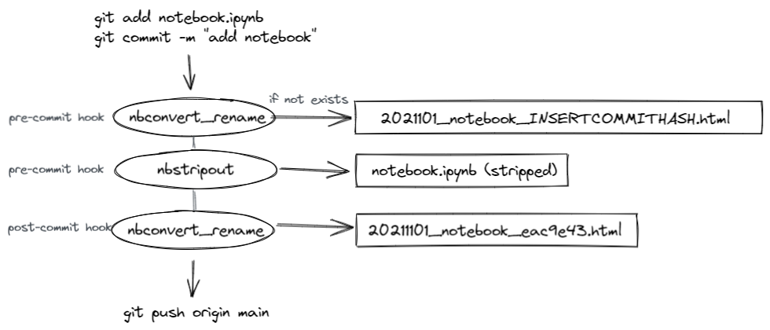

[](https://github.com/allianz-direct/nb_prep/actions/workflows/unit_tests.yml)


# nb_prep

Use `nbconvert` and `nbstripout` together as precommit hooks.

A pre-commit hook that converts any changed jupyter notebooks (`.ipynb`) to `.html` files with a YYYMMDD date prefix and commit hash suffix added:

`my_notebook.ipynb` -> `20211026_my_notebook_eac9e43.html`

## Use case

You use [jupyter notebooks](https://jupyter.org/) and:

- [nbconvert](https://github.com/jupyter/nbconvert) to convert `.ipynb` files to `.html` files
- [nbstripout](https://github.com/kynan/nbstripout) to avoid committing (potentially sensitive) data to git and get proper `git diff`s on notebooks (only showing changes in code).

Forget to run `nbconvert`, or use them in the wrong order (`nbstripout` before `nbconvert`) and you will have to re-run your notebooks before you can output HTML, which can be annoying when they are long-running. Especially when you use `nbstripout` as a [pre-commit](https://pre-commit.com/) hook, this can happen quite often.

`nb_prep` can help to automatically process notebooks and (optionally) store versioned output in an in output directory. The CLI command `nb_convert_strip` takes a list of directories and/or files to find and convert notebooks. For each notebook:

- `nbconvert` is used to create an `<filename>.html` export
- Date prefix is added `YYYYMMDD_<filename>.html` (can be turned off)
- Placeholder for git hash is added `YYYYMMDD_<filename>_20211026_notebook_NBCONVERT_RENAME_COMMITHASH_PLACEHOLDER.html`
- `.html` file is moved to `output-dir` (if specified)
- `nbstripout` is used strip output from notebook

Now you can `git add` and `git commit` the changed notebook files. You can then use `nb_convert_strip rename` will replace insert the commit hashes in the notebook filenames.

You can setup this entire workflow once as [pre-commit](https://pre-commit.com/) hook, and basically get an up-to-date analysis output directory for free `output-dir`. Schematically:




## Installation

```bash
pip install nb_prep
```

## Usage [TODO, update]

You need to update the `.pre-commit-config.yaml` in your repository. We'll assume you want to use `nbconvert_rename` with [nbstripout](https://github.com/kynan/nbstripout#using-nbstripout-as-a-pre-commit-hook) and include that here:

```yaml
default_stages: [commit]
repos:
-   repo: local
    hooks:
    -   id: nbconvert_rename_precommit
        name: nb_prep (pre-commit; run nbconvert)
        description: 'Converts to .ipynb to .html and adds date prefix and hash placeholder.'
        entry: nbconvert_rename
        language: python
        language_version: python3
        types: [jupyter]
        stages: [commit]
    -   id: nbconvert_rename_postcommit
        name: nb_prep (post-commit; replace commithash in .html filenames)
        description: 'Replaces NBCONVERT_RENAME_COMMITHASH_PLACEHOLDER with commit hash in any .html filenames.'
        entry: rename_commithash
        types: [html]    
        language: python
        language_version: python3
        always_run: true
        stages: [post-commit]
```

```yaml
repos:
-   repo: https://github.com/psf/black
    rev: stable
    hooks:
    - id: black
```


You need to install the pre-commit and the post-commit hooks separately:

```shell
pre-commit install
pre-commit install --hook-type post-commit
```

When you commit a notebook, you might see something like:

```shell
git add notebook.ipynb
git commit -m "Add notebook"
# nb_prep (pre-commit; run nbconvert)............................Passed
# nbstripout........................................................................Failed
# - hook id: nbstripout
# - files were modified by this hook
# nb_prep (post-commit; replace commithash in .html filenames)...Passed
```

`nbstripout` has overwritten `notebook.ipynb` and `nbconvert-rename` has created a file named something like `20211026_notebook_NBCONVERT_RENAME_COMMITHASH_PLACEHOLDER.html`.
Make sure to avoid committing HTML files by adding `.html` added to your `.gitignore` file. Next:

```shell
git add notebook.ipynb
git commit -m "Add notebook"
# nb_prep (pre-commit; run nbconvert)............................Passed
# nbstripout........................................................................Passed
# nb_prep (post-commit; replace commithash in .html filenames)...Passed
```

Now, you've committed a clean, stripped version of `notebook.ipynb` and you have a local snapshot of your notebook named something like `20211026_notebook_eac9e43.html`.

## Options

### Using templates

If you want to specify a different template for `nbconvert`, you can add an argument to the `nbconvert_rename_precommit` hook:

```yaml
-   repo: local
    hooks:
    -   id: nbconvert_rename_precommit
        entry: nbconvert_rename
        ...
        args: ["--template","reveal"]
```

### Removing cell blocks

You can also choose to remove input code blocks (equivalent to `jupyter nbconvert --no-input`)

```yaml
-   repo: local
    hooks:
    -   id: nbconvert_rename_precommit
        entry: nbconvert_rename
        ...
        args: ["--no-input"]
```

### Specifying an output directory

You might want to output all HTML notebooks in a specific folder. You can specify a relative (to project root) or absolute path using `--output-dir`:

```yaml
-   repo: local
    hooks:
    -   id: nbconvert_rename_precommit
        entry: nbconvert_rename
        ...
        args: ["--output-dir","../data/notebooks"]
```

### Excluding directories and files

You can ignore certain notebooks or even entire directories with [globs](https://docs.python.org/3/library/glob.html), using a relative (to project root) or absolute path with `--exclude`. For example:

```yaml
-   repo: local
    hooks:
    -   id: nbconvert_rename_precommit
        entry: nbconvert_rename
        ...
        args: ["--exclude","../data/notebooks/*", "a_notebook.ipynb"]
```
